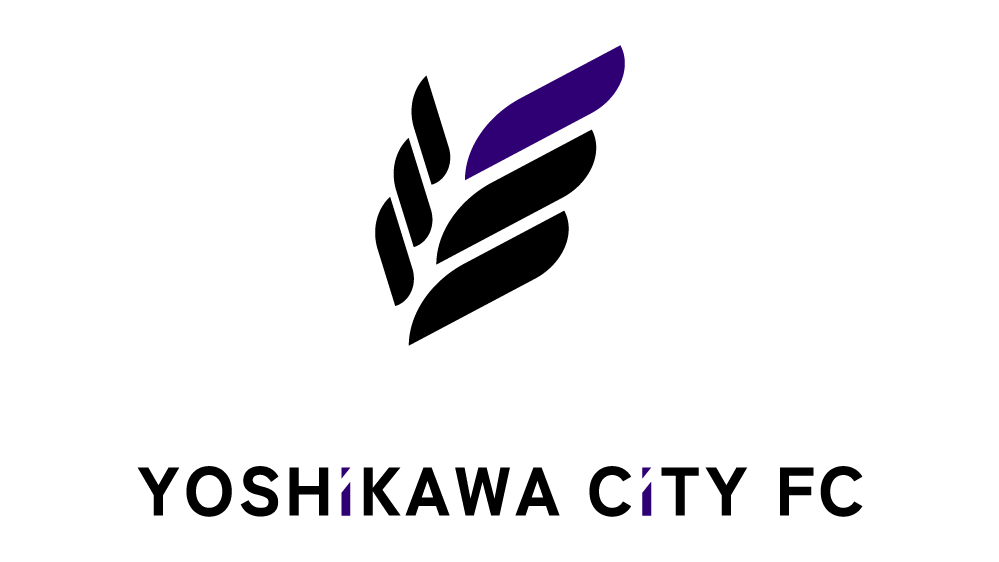

<!-- ALL-CONTRIBUTORS-BADGE:START - Do not remove or modify this section -->
[](#contributors-)
<!-- ALL-CONTRIBUTORS-BADGE:END -->

[](https://github.com/yoshikawacityfc/yoshikawacityfc/actions/workflows/staging.yml)
[](https://github.com/yoshikawacityfc/yoshikawacityfc/actions/workflows/production.yml)



YOSHiKAWA CiTY FC
=================

吉川市のサッカーチーム YOSHiKAWA CiTY FC 公式サイトです。  
「吉川市のフットボール文化を創り、育む」をテーマに活動しています。

## Tech Stacks

### [Turborepo](https://turbo.build/repo)

Monorepo を構成する上で、 Next.js と親和性の高い Turborepo を利用しています。

### [Next.js](https://nextjs.org/)

TypeScript で開発する上で、情報量も多い Next.js を利用しています。

### [Tailwind CSS](https://tailwindcss.com/)

CSS を記述するにあたりカスタマイズ性に優れている Tailwind CSS を利用しています。

### [Supabase](https://supabase.com/)

バックエンド関連処理に Supabase を採用することで、初期の管理コスト削減を図っています。

## GetStarted

以下の手順を踏んで開発に参加しましょう。

### 1. Bootstrap

以下のコマンドを実行して開発環境を整えます。

```shell
$ make bs
```

### 2. `pnpm run dev`

`pnpm run dev`でローカルサーバーを立ち上げます。  
表示された URL にアクセスすると、サイトが表示されます。

```shell
$ pnpm run dev
```

## Contributors ✨

<a href="https://github.com/yoshikawacityfc/yoshikawacityfc/graphs/contributors">
  
</a>

Made with [contrib.rocks](https://contrib.rocks).

## License

This software is provided under the [MIT License](LICENSE).
